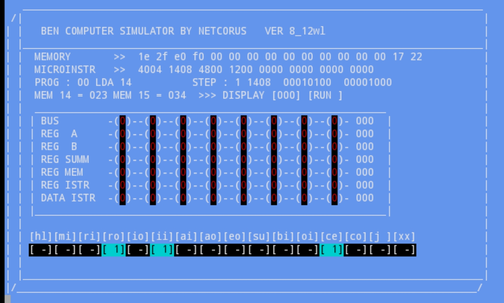

# Bensim is a simulator for 8 bit computer

made in c it run simple assembler List 
istruction

Can be use in windows or linux 

I made it for my student ... i hope can be
Usefull for you also.

I’m looking to collaborate on bensim 

